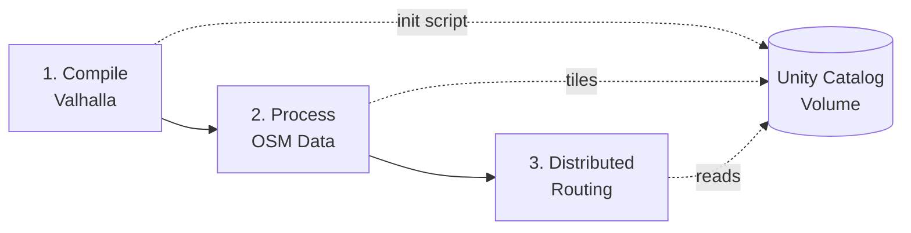

# Valhalla Routing Engine for Databricks

Production-ready Databricks Asset Bundle for deploying and operating the [Valhalla](https://github.com/valhalla/valhalla) open-source routing engine on Databricks Runtime 18.0+.

## Overview

This project enables large-scale routing computations using Valhalla on Databricks clusters with Unity Catalog integration. It provides automated compilation, OSM data processing, and distributed routing capabilities.

### Features

- ✅ **DBR 18.0+ Compatible** - Handles GCC 11+ compilation requirements
- ✅ **Unity Catalog Integration** - Persistent storage for compiled artifacts and routing tiles
- ✅ **Multi-Cloud Support** - Works on AWS, Azure, and GCP
- ✅ **Automated Deployment** - Complete workflow via Databricks Asset Bundles
- ✅ **Distributed Routing** - Scale routing computations with Spark
- ✅ **Multiple Routing Modes** - Auto, bicycle, pedestrian, and more

### How It Works



1. **Compile Once**: Build Valhalla and create init script (15-30 min)
2. **Process OSM Data**: Convert PBF files to routing tiles (5-60 min depending on region)
3. **Route at Scale**: Execute millions of routing queries in parallel

## Prerequisites

- Databricks workspace (AWS, Azure, or GCP)
- Unity Catalog enabled
- Databricks Runtime 18.0.x or higher
- Permissions to create catalogs, schemas, and volumes
- Databricks CLI installed ([installation guide](https://docs.databricks.com/dev-tools/cli/index.html))

## Quick Start

### 1. Clone and Configure

```bash
git clone <repository-url>
cd valhalla_20260121
```

### 2. Configure Unity Catalog

Update `databricks.yml` with your Unity Catalog settings:

```yaml
variables:
  valhalla_catalog:
    default: "your_catalog"  # Change to your catalog name
  
  valhalla_schema:
    default: "your_schema"  # Change to your schema name
  
  valhalla_volume:
    default: "valhalla_region"  # Volume for artifacts/tiles
```

### 3. Authenticate

```bash
# For GCP (default)
databricks auth login --profile gcp --host <your-workspace-url>

# For Azure
databricks auth login --profile azure --host <your-workspace-url>

# For AWS
databricks auth login --profile aws --host <your-workspace-url>
```

### 4. Deploy

```bash
# Validate configuration
databricks bundle validate -t gcp

# Deploy to workspace
databricks bundle deploy -t gcp
```

### 5. Run Test Job

```bash
# Run end-to-end test (Andorra region)
databricks bundle run valhalla_test_job -t gcp
```

**Expected Duration**: 25-35 minutes
- Task 1: Compile Valhalla (~10-15 min)
- Task 2: Process Andorra OSM data (~5-10 min)
- Task 3: Run automated tests (~5 min)

## Notebooks

| Notebook | Purpose | Estimated Runtime |
|----------|---------|------------------|
| [`valhalla_00_initial_setup.py`](src/notebooks/valhalla_00_initial_setup.py) | Compile Valhalla and create init script | 15-30 min |
| [`valhalla_01_process_pbf.py`](src/notebooks/valhalla_01_process_pbf.py) | Process OSM PBF files into routing tiles | 5-60 min |
| [`valhalla_quickstart.py`](src/notebooks/valhalla_quickstart.py) | Complete end-to-end setup guide | 30-90 min |
| [`valhalla_test_routing.py`](src/notebooks/valhalla_test_routing.py) | Automated testing suite | 5-10 min |

See [NOTEBOOKS.md](NOTEBOOKS.md) for detailed documentation.

## Architecture

### Storage Layout

```
/Volumes/your_catalog/your_schema/valhalla_region/
├── bin/                    # Compiled Valhalla binaries
├── lib/                    # Shared libraries
├── whl/                    # Python wheel file
├── init.sh                 # Cluster init script
├── tiles/                  # Routing tiles (per region)
│   ├── 0/                 # Level 0 tiles
│   ├── 1/                 # Level 1 tiles
│   └── 2/                 # Level 2 tiles
└── valhalla.json          # Valhalla configuration
```

### Compilation Strategy

**Problem**: Databricks Runtime 18.0 uses GCC 11+, which treats `format-truncation` warnings as errors, causing Valhalla compilation to fail.

**Solution**: Add compiler flags to suppress these warnings:

```bash
cmake \
  -DCMAKE_CXX_FLAGS="-Wno-error=format-truncation -Wno-format-truncation" \
  ...
```

This fix is applied automatically in `valhalla_00_initial_setup.py`.

## Multi-Cloud Configuration

### Machine Type Recommendations

| Cloud | Compilation Cluster | Testing Cluster |
|-------|-------------------|----------------|
| **GCP** | n2-highmem-32 | n2-standard-8 |
| **AWS** | r5.8xlarge | m5.2xlarge |
| **Azure** | Standard_E32s_v3 | Standard_D8s_v3 |

Update `node_type_id` in `resources/valhalla_test_job.yml` for your cloud provider.

### Authentication Per Cloud

See [DEPLOYMENT.md](DEPLOYMENT.md) for detailed cloud-specific setup instructions.

## Usage Examples

### Process a Region

```python
# In valhalla_quickstart.py or custom notebook

# 1. Configure region
pbf_url = "https://download.geofabrik.de/europe/andorra-latest.osm.pbf"
catalog = 'your_catalog'
schema = 'your_schema'
volume = 'valhalla_andorra'

# 2. Run setup (first time only)
dbutils.notebook.run(
    "valhalla_00_initial_setup",
    timeout_seconds=3600,
    arguments={"VOLUME_PATH": f"/Volumes/{catalog}/{schema}/{volume}"}
)

# 3. Process PBF
dbutils.notebook.run(
    "valhalla_01_process_pbf",
    timeout_seconds=3600,
    arguments={
        "VOLUME_PATH": f"/Volumes/{catalog}/{schema}/{volume}",
        "PBF_URL": pbf_url
    }
)
```

### Distributed Routing

```python
import valhalla
from pyspark.sql.functions import pandas_udf
import pandas as pd

# Load actor (routing engine)
actor = valhalla.Actor()

# Define routing UDF
@pandas_udf("string")
def route_udf(origin_lat: pd.Series, origin_lon: pd.Series,
              dest_lat: pd.Series, dest_lon: pd.Series) -> pd.Series:
    routes = []
    for o_lat, o_lon, d_lat, d_lon in zip(origin_lat, origin_lon, dest_lat, dest_lon):
        request = {
            "locations": [
                {"lat": o_lat, "lon": o_lon},
                {"lat": d_lat, "lon": d_lon}
            ],
            "costing": "auto"
        }
        result = actor.route(request)
        routes.append(result)
    return pd.Series(routes)

# Apply to DataFrame
routes_df = df.withColumn("route", route_udf("origin_lat", "origin_lon", "dest_lat", "dest_lon"))
```

## Troubleshooting

### Compilation Fails

**Symptom**: Task 1 fails with GCC errors

**Solution**: Ensure you're using DBR 18.0.x or higher with the compiler flags patch applied in `valhalla_00_initial_setup.py`

### Volume Permission Errors

**Symptom**: `No Unity API token found in Unity Scope`

**Solution**: Use `SINGLE_USER` data security mode in cluster configuration (not `NONE`)

### PBF Processing Slow

**Symptom**: Task 2 takes longer than expected

**Solution**: 
- Use larger machine type (32+ vCPUs recommended)
- Ensure single-node cluster (`num_workers: 0`)
- Check network bandwidth to PBF download source

### Tiles Not Found

**Symptom**: Routing fails with "tiles not found"

**Solution**: Verify tiles exist at `/Volumes/.../tiles/` and init script was applied successfully

See [DEPLOYMENT.md](DEPLOYMENT.md) for more troubleshooting guidance.

## Cost Estimation

### GCP Pricing Example (Andorra Test Region)

| Task | Machine Type | Duration | Cost |
|------|-------------|----------|------|
| Compilation | n2-highmem-32 | 15 min | ~$0.80 |
| PBF Processing | n2-highmem-32 | 5 min | ~$0.27 |
| Testing | n2-standard-8 (3 nodes) | 5 min | ~$0.20 |
| **Total** | | **25 min** | **~$1.27** |

*Costs vary by cloud provider and region. Add Databricks platform costs (DBU consumption).*

## Project Structure

```
valhalla_20260121/
├── databricks.yml                          # Bundle configuration
├── resources/
│   └── valhalla_test_job.yml              # End-to-end test job
├── src/
│   └── notebooks/                          # Databricks notebooks
│       ├── valhalla_00_initial_setup.py   # Compilation
│       ├── valhalla_01_process_pbf.py     # PBF processing
│       ├── valhalla_quickstart.py         # Quickstart guide
│       └── valhalla_test_routing.py       # Automated tests
├── DEPLOYMENT.md                          # Deployment guide
├── NOTEBOOKS.md                           # Notebook documentation
└── README.md                              # This file
```

## Contributing

Contributions welcome! Please ensure:

- Code follows existing patterns
- Notebooks include markdown documentation
- Changes work on all three cloud providers
- Compiler flags remain for DBR 18.0+ compatibility

## References

### Valhalla Documentation

- [Valhalla GitHub](https://github.com/valhalla/valhalla)
- [Valhalla API Documentation](https://valhalla.github.io/valhalla/)
- [Routing API Reference](https://valhalla.github.io/valhalla/api/turn-by-turn/)

### Databricks Documentation

- [Databricks Asset Bundles](https://docs.databricks.com/dev-tools/bundles/index.html)
- [Unity Catalog Volumes](https://docs.databricks.com/data-governance/unity-catalog/volumes.html)
- [Cluster Init Scripts](https://docs.databricks.com/clusters/init-scripts.html)
- [Databricks Runtime Release Notes](https://docs.databricks.com/release-notes/runtime/index.html)

### OSM Data Sources

- [Geofabrik Downloads](https://download.geofabrik.de/) - Regional PBF extracts
- [OpenStreetMap](https://www.openstreetmap.org/) - Main OSM project

## License

This project provides a deployment framework for Valhalla. Valhalla itself is licensed under MIT License. See the [Valhalla repository](https://github.com/valhalla/valhalla) for details.

## Support

For issues specific to this Databricks implementation:
- Open an issue in this repository
- Include cluster logs, notebook output, and DBR version

For Valhalla routing engine questions:
- See [Valhalla documentation](https://valhalla.github.io/valhalla/)
- Visit [Valhalla GitHub discussions](https://github.com/valhalla/valhalla/discussions)
