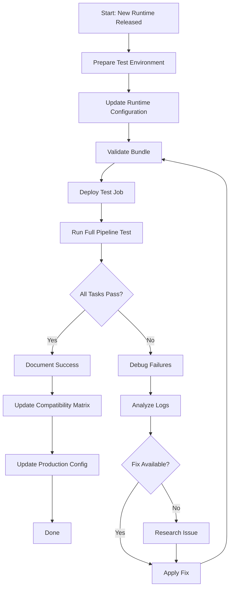

# Runtime Testing Guide

Comprehensive workflow for testing Valhalla compilation and functionality against new Databricks runtimes.

## Table of Contents

1. [Introduction](#introduction)
2. [Using the Runtime Tester Agent](#using-the-runtime-tester-agent)
3. [Prerequisites](#prerequisites)
4. [Testing Workflow](#testing-workflow)
5. [Validation Checklist](#validation-checklist)
6. [Modifying Compiler Flags](#modifying-compiler-flags)
7. [Troubleshooting by Runtime](#troubleshooting-by-runtime)
8. [Compatibility Matrix](#compatibility-matrix)
9. [Examples](#examples)
10. [Best Practices](#best-practices)
11. [Updating Production](#updating-production)

## Introduction

### Purpose

This guide provides a systematic approach for validating Valhalla compilation against new Databricks Runtime (DBR) versions before adopting them in production. Testing ensures:

- Valhalla compiles successfully on the new runtime
- GCC/CMake version changes don't break the build
- Python bindings work correctly
- Distributed routing functionality remains intact

### Target Audience

- Repository maintainers
- Contributors adding runtime support
- Teams deploying to new Databricks environments

### When to Use

- **New Runtime Release**: Test DBR 19.0, 20.0, 21.0 when available
- **Pre-Production Validation**: Before migrating production workloads
- **Dependency Updates**: When Databricks changes GCC, CMake, or Python versions
- **Troubleshooting**: Debug compilation issues on specific runtimes

## Using the Runtime Tester Agent

**Recommended**: Use the `@runtime-tester` Cursor agent to automate this workflow.

### Quick Start with Agent

```
@runtime-tester What runtimes are available to test?
@runtime-tester Test DBR 19.0
@runtime-tester Test the latest available LTS runtime
```

The agent will:
1. **Discover** available runtimes via Databricks CLI
2. **Suggest** which runtime to test based on your current production version
3. **Create** isolated test environment (catalog, schema, volume)
4. **Configure** job files with new runtime version
5. **Deploy** and run full pipeline test (~30-40 min)
6. **Validate** all artifacts and generate report
7. **Fix** compiler issues automatically if Task 1 fails
8. **Update** documentation and compatibility matrix
9. **Optionally** update production configs after success

### Agent Capabilities

- **Automated runtime discovery**: Queries CLI, never assumes versions exist
- **Intelligent error handling**: Parses logs, suggests specific compiler flags
- **Full validation**: Checks compilation, PBF processing, routing functionality
- **Multi-cloud support**: Can test on GCP, Azure, AWS sequentially
- **Documentation sync**: Updates RUNTIME_TESTING.md matrix and production configs

### Usage Examples

**Discovery mode**:
```
@runtime-tester What runtimes are available to test?
```
Output: Lists available runtimes and suggests next one to test

**Test specific runtime**:
```
@runtime-tester Test DBR 19.0
```
Runs full workflow for DBR 19.0 automatically

**Troubleshooting**:
```
@runtime-tester Task 1 failed with compiler errors, help me fix it
```
Analyzes logs, updates compiler flags, retries test

**Production update**:
```
@runtime-tester Update production configs to use DBR 19.0
```
Updates all files after successful test validation

### Manual Workflow

If you prefer manual testing or the agent is unavailable, follow the detailed workflow below.

## Prerequisites

### Required Access

- Databricks workspace (preferably non-production for testing)
- Unity Catalog permissions:
  - `CREATE CATALOG`, `CREATE SCHEMA`, `CREATE VOLUME`
  - `USE CATALOG`, `USE SCHEMA` on test catalog/schema
  - `WRITE FILES` on test volumes
- Databricks CLI installed and authenticated
- Permission to create and run jobs

### Knowledge Requirements

- Basic understanding of GCC compiler versions
- Familiarity with Databricks Asset Bundles
- Unity Catalog concepts (catalogs, schemas, volumes)
- Reading Databricks release notes

### Environment Setup

```bash
# Verify CLI installation
databricks --version  # Should be v0.213.0 or higher

# Verify authentication
databricks auth profiles

# Check current runtime release notes
# https://docs.databricks.com/release-notes/runtime/index.html
```

## Testing Workflow

### Overview



### Step 1: Prepare Test Environment

Create an isolated testing environment to avoid interfering with production artifacts.

**1.1 Create Test Catalog and Schema**

```sql
-- Run in Databricks SQL or notebook
CREATE CATALOG IF NOT EXISTS test_catalog;
CREATE SCHEMA IF NOT EXISTS test_catalog.runtime_testing;
```

**1.2 Create Version-Specific Volume**

Use runtime version in volume name for easy identification:

```bash
# For DBR 19.0 testing
databricks volumes create test_catalog runtime_testing valhalla_dbr19_test

# For DBR 20.0 testing
databricks volumes create test_catalog runtime_testing valhalla_dbr20_test
```

**1.3 Verify Volume Creation**

```bash
databricks volumes list test_catalog runtime_testing
```

### Step 2: Configure Runtime Version

The project uses `spark_version` and `runtime_engine` variables in `databricks.yml` that are referenced by all tasks in the job configuration. This ensures runtime consistency across all tasks.

**Configuration Structure**:

`databricks.yml`:
```yaml
variables:
  spark_version:
    description: "Databricks Runtime version for all tasks"
    default: "18.0.x-scala2.13"  # Current production
  
  runtime_engine:
    description: "Runtime engine: STANDARD or PHOTON"
    default: "STANDARD"
```

`resources/valhalla_test_job.yml` (all 3 tasks):
```yaml
new_cluster:
  spark_version: "${var.spark_version}"  # References variable
  runtime_engine: "${var.runtime_engine}"  # STANDARD or PHOTON
  # ... rest of config
```

**IMPORTANT - Photon Configuration**:

When testing with Photon, you must understand how Databricks specifies Photon clusters:

- ❌ **WRONG**: `spark_version: "17.3.x-photon-scala2.13"` (this will fail with INVALID_PARAMETER_VALUE)
- ✅ **CORRECT**: `spark_version: "17.3.x-scala2.13"` + `runtime_engine: "PHOTON"`

**Why this matters**:
- The Databricks API `spark-versions list` returns versions like `17.3.x-photon-scala2.13`
- However, when creating clusters, Photon is specified via `runtime_engine` parameter
- Always split Photon versions into base version + runtime_engine parameter

**To Test a Different Runtime**:

Simply override variables during deployment - no file editing required:

```bash
# Test DBR 19.0 (standard) - replace <target> with your cloud (gcp/azure/aws)
databricks bundle deploy -t <target> \
  --var="spark_version=19.0.x-scala2.13" \
  --var="valhalla_catalog=test_catalog" \
  --var="valhalla_schema=runtime_testing" \
  --var="valhalla_volume=valhalla_dbr19_test"

# Test DBR 17.3 LTS with Photon
databricks bundle deploy -t <target> \
  --var="spark_version=17.3.x-scala2.13" \
  --var="runtime_engine=PHOTON" \
  --var="valhalla_catalog=test_catalog" \
  --var="valhalla_schema=runtime_testing" \
  --var="valhalla_volume=valhalla_dbr17_test"
```

**Benefits of This Approach**:
- ✅ Single source of truth for runtime version and engine
- ✅ No need to create/maintain separate job files
- ✅ All 3 tasks guaranteed to use the same runtime and engine
- ✅ Easy to switch between runtimes and test Photon
- ✅ Production runtime/engine defined in `databricks.yml` defaults

**2.2 Document Runtime Versions**

Check Databricks release notes to document key versions:

| Component | DBR 18.0 | DBR 19.0 | Notes |
|-----------|----------|----------|-------|
| GCC | 11.4 | TBD | Check release notes |
| CMake | 3.x | TBD | Check release notes |
| Python | 3.11 | TBD | Check release notes |
| Scala | 2.13 | TBD | Usually stable |

### Step 3: Validate and Deploy

**3.1 Validate Bundle Configuration**

```bash
# Validate configuration syntax with test runtime
databricks bundle validate -t <target>  # gcp, azure, or aws

# Expected output:
# Validation successful!
```

**3.2 Deploy to Workspace with Test Configuration**

```bash
# Deploy with DBR 19.0 and test volume
databricks bundle deploy -t <target> \
  --var="spark_version=19.0.x-scala2.13" \
  --var="valhalla_catalog=test_catalog" \
  --var="valhalla_schema=runtime_testing" \
  --var="valhalla_volume=valhalla_dbr19_test"

# Expected output:
# Successfully deployed!
# Bundle deployed to: /Users/<username>/.bundle/valhalla/<target>
```

**3.3 Verify Deployment**

```bash
# List deployed jobs
databricks jobs list --output json | grep valhalla_test

# Or check in UI:
# Workspace → Workflows → Jobs → valhalla_test_<target>
```

### Step 4: Run Full Pipeline Test

**4.1 Trigger Test Job**

```bash
# Run with log streaming
databricks bundle run valhalla_test_job -t <target> --follow

# Or run without streaming (check logs later)
databricks bundle run valhalla_test_job -t <target>
```

**4.2 Monitor Progress**

The test runs three sequential tasks (~30-40 minutes total):

1. **Task 1: initial_setup** (~10-15 min)
   - Installs dependencies
   - Compiles Valhalla from source
   - Builds Python wheel
   - Generates init script

2. **Task 2: process_pbf** (~5-10 min)
   - Downloads Andorra OSM data (3 MB)
   - Builds routing tiles
   - Generates Valhalla configuration

3. **Task 3: test_routing** (~5 min)
   - Tests Python bindings
   - Validates multi-modal routing
   - Tests distributed routing

**4.3 Check Email Notifications**

Email notifications are sent to the job owner:
- On success: All tasks completed
- On failure: Which task failed and error summary

### Step 5: Validate Results

**5.1 Check Job Status**

```bash
# Get latest run status
databricks jobs list-runs --job-id <job-id> --limit 1

# Or via UI:
# Workflows → Jobs → valhalla_test_<target> → Runs
```

**5.2 Review Task Logs**

For each task, review logs for warnings or errors:

```bash
# Get run logs (if you have run ID)
databricks runs get-output --run-id <run-id>
```

**5.3 Verify Volume Artifacts**

Check that artifacts were created:

```bash
# List volume contents
databricks fs ls dbfs:/Volumes/test_catalog/runtime_testing/valhalla_dbr19_test/

# Expected structure:
# bin/              # Valhalla binaries and libraries
# whl/              # Python wheel
# tiles/            # Routing tiles (after task 2)
# init.sh           # Init script
```

**5.4 Inspect Compilation Output**

Key things to check in Task 1 logs:

- GCC version used: `gcc --version`
- CMake configuration output
- Compiler warnings (look for new format-truncation or similar)
- Link errors or missing libraries
- Python wheel build success

## Validation Checklist

Use this checklist to systematically validate each phase:

### Compilation Phase (Task 1)

- [ ] **Environment verified**: GCC, CMake, Python versions logged
- [ ] **Dependencies installed**: All apt packages installed successfully
- [ ] **Valhalla cloned**: Repository and submodules cloned
- [ ] **CMake configured**: Configuration completes without errors
- [ ] **Compilation succeeds**: Make completes with 0 errors
- [ ] **No new warnings**: Check for new compiler warnings
- [ ] **Binaries installed**: Valhalla binaries copied to /usr/local/bin
- [ ] **Libraries linked**: ldconfig runs successfully
- [ ] **Python wheel built**: .whl file created in volume
- [ ] **Binaries cached**: All files copied to volume bin/ directory
- [ ] **Init script generated**: init.sh created in volume root
- [ ] **Python import works**: `import valhalla` succeeds

### PBF Processing Phase (Task 2)

- [ ] **Init script loads**: Cluster startup applies init script successfully
- [ ] **Valhalla restored**: Binaries restored from volume
- [ ] **Python wheel installed**: Wheel installs from volume
- [ ] **PBF downloads**: Andorra file downloads (should be ~3 MB)
- [ ] **Tiles build**: valhalla_build_tiles completes successfully
- [ ] **Tiles created**: tiles/0/, tiles/1/, tiles/2/ directories exist
- [ ] **Config generated**: valhalla.json created
- [ ] **SQLite files present**: admins.sqlite, timezones.sqlite exist

### Routing Phase (Task 3)

- [ ] **Python bindings load**: `import valhalla` succeeds on worker nodes
- [ ] **Auto routing works**: Car routing succeeds
- [ ] **Bicycle routing works**: Bicycle routing succeeds
- [ ] **Pedestrian routing works**: Walking routing succeeds
- [ ] **Distributed routing**: Routing works across multiple workers
- [ ] **Route quality**: Routes are sensible (not empty or invalid)

## Modifying Compiler Flags

If compilation fails due to new GCC warnings or errors, you'll need to update compiler flags.

### Understanding Current Flags

**Current flags** (DBR 18.0):
```cmake
-DCMAKE_CXX_FLAGS="-Wno-error=format-truncation -Wno-format-truncation"
-DCMAKE_C_FLAGS="-Wno-error=format-truncation -Wno-format-truncation"
```

**Purpose**: GCC 11+ treats `format-truncation` warnings as errors. These flags downgrade them to warnings.

### Where to Modify Flags

**File**: `src/notebooks/valhalla_00_initial_setup.py`

**Lines**: 214-218

```python
# DBTITLE 1,Build Valhalla and Python Wheel
# MAGIC %sh
# MAGIC set -euxo pipefail
# MAGIC
# MAGIC echo "🔨 Building Valhalla..."
# MAGIC cd /local_disk0/valhalla_build/valhalla/
# MAGIC
# MAGIC # Configure Valhalla with Python bindings and compiler flags for GCC 11+
# MAGIC # Key fix: -Wno-error=format-truncation prevents format-truncation warnings from failing the build
# MAGIC echo "Running CMake configuration..."
# MAGIC cmake -B build \
# MAGIC   -DCMAKE_BUILD_TYPE=Release \
# MAGIC   -DENABLE_PYTHON_BINDINGS=ON \
# MAGIC   -DCMAKE_CXX_FLAGS="-Wno-error=format-truncation -Wno-format-truncation" \
# MAGIC   -DCMAKE_C_FLAGS="-Wno-error=format-truncation -Wno-format-truncation"
```

### Adding New Flags

**Step 1: Identify the Warning**

From compilation logs, find the specific warning causing failure:

```
error: 'some-warning' warning treated as error [-Werror=some-warning]
```

**Step 2: Add Flag to Downgrade Error**

Update CMAKE_CXX_FLAGS:

```python
# MAGIC   -DCMAKE_CXX_FLAGS="-Wno-error=format-truncation -Wno-format-truncation -Wno-error=some-warning -Wno-some-warning" \
# MAGIC   -DCMAKE_C_FLAGS="-Wno-error=format-truncation -Wno-format-truncation -Wno-error=some-warning -Wno-some-warning"
```

**Flag pattern**:
- `-Wno-error=X`: Don't treat warning X as an error
- `-Wno-X`: Don't show warning X at all

**Step 3: Test the Fix**

Re-run the test job:

```bash
databricks bundle deploy -t <target>
databricks bundle run valhalla_test_job -t <target> --follow
```

**Step 4: Document the Change**

Add to RUNTIME_TESTING.md compatibility matrix with notes explaining the new flag.

### Example: Adding Multiple Flags

For DBR 19.0 with hypothetical new warnings:

```cmake
-DCMAKE_CXX_FLAGS="-Wno-error=format-truncation -Wno-format-truncation -Wno-error=array-bounds -Wno-array-bounds -Wno-error=deprecated-declarations"
```

### Common GCC Warnings

| Warning | Description | When Added |
|---------|-------------|------------|
| `format-truncation` | String formatting may truncate | GCC 7+ |
| `array-bounds` | Array index out of bounds | GCC 4.3+ |
| `deprecated-declarations` | Using deprecated API | GCC 3.4+ |
| `class-memaccess` | Unsafe memory operations on classes | GCC 8+ |
| `stringop-overflow` | String operation buffer overflow | GCC 7+ |

## Troubleshooting by Runtime

### DBR 19.0

**Expected Changes**:
- Check release notes for GCC version
- Likely Python 3.11 or 3.12
- May introduce new compiler warnings

**Common Issues**:
- New GCC warnings treated as errors → Add flags
- Python API changes → Update notebook code
- Library version updates → Update apt package list

**Testing checklist**:
- [ ] Document GCC version in logs
- [ ] Check for new compiler warnings
- [ ] Verify Python bindings still work
- [ ] Test with small PBF file first

### DBR 20.0

**Expected Changes**:
- Major GCC version bump possible (GCC 12+?)
- CMake version updates
- Python 3.12+ likely

**Common Issues**:
- Significant compiler changes → Multiple new flags needed
- CMake minimum version → May need cmake flags
- Python binding compatibility → Test thoroughly

**Testing checklist**:
- [ ] Check CMake minimum version requirements
- [ ] Test Python 3.12 compatibility
- [ ] Validate all routing modes still work
- [ ] Check for performance regressions

### DBR 21.0

**Expected Changes**:
- LTS considerations
- Stability focus
- Minimal breaking changes expected

**Common Issues**:
- Should be minimal if 19.0, 20.0 worked
- Focus on performance validation
- Check for deprecated API removals

## Compatibility Matrix

Track tested runtimes and their requirements:

| Runtime | GCC Version | CMake Version | Python | Status | Compiler Flags | Notes | Tested Date | Tested By |
|---------|-------------|---------------|--------|--------|----------------|-------|-------------|-----------|
| 17.3.x (LTS) | 11.3.0 | 3.22.1 | 3.10 | ✅ Supported | `-Wno-error=format-truncation -Wno-format-truncation` | LTS runtime - All 8 tests passed | 2025-01-21 | Timo Roest |
| 18.0.x | 11.4.0 | 3.25.1 | 3.11 | ✅ Supported | `-Wno-error=format-truncation -Wno-format-truncation` | Current production runtime | 2025-01-21 | Timo Roest |
| 19.0.x | TBD | TBD | TBD | 🧪 Not Tested | TBD | Awaiting release | - | - |
| 20.0.x | TBD | TBD | TBD | 🧪 Not Tested | TBD | Future testing | - | - |
| 21.0.x | TBD | TBD | TBD | 🧪 Not Tested | TBD | Future testing | - | - |

**Status Key**:
- ✅ **Supported**: Fully tested and working in production
- 🧪 **Testing**: Currently being validated
- ⚠️ **Issues**: Known issues, workaround available
- ❌ **Not Supported**: Compilation fails, no workaround yet
- 🧪 **Not Tested**: Runtime not yet available or tested

### Adding Test Results

After successful testing, update the matrix:

```markdown
| 19.0.x | 12.1.0 | 3.28.0 | 3.12 | ✅ Supported | `-Wno-error=format-truncation -Wno-format-truncation -Wno-error=array-bounds` | New array-bounds warning added | 2025-03-15 | Your Name |
```

## Examples

### Example 1: Testing DBR 19.0 (Full Workflow)

Complete workflow from setup to validation:

```bash
# === STEP 1: PREPARE ENVIRONMENT ===

# Create test catalog and schema (via SQL in notebook or SQL editor)
# CREATE CATALOG IF NOT EXISTS test_catalog;
# CREATE SCHEMA IF NOT EXISTS test_catalog.runtime_testing;

# Create volume for DBR 19.0 testing
databricks volumes create test_catalog runtime_testing valhalla_dbr19_test

# Verify volume creation
databricks volumes list test_catalog runtime_testing


# === STEP 2: CONFIGURE RUNTIME ===

# Copy base job configuration
cp resources/valhalla_test_job.yml resources/valhalla_test_job_dbr19.yml

# Edit the file to update spark_version to "19.0.x-scala2.13" in all 3 tasks
# (Use your text editor of choice)

# Update databricks.yml to include test config
# Edit line 9 to: - resources/valhalla_test_job_dbr19.yml


# === STEP 3: VALIDATE AND DEPLOY ===

# Validate bundle configuration
databricks bundle validate -t <target>

# Deploy to workspace
databricks bundle deploy -t <target> \
  --var="valhalla_catalog=test_catalog" \
  --var="valhalla_schema=runtime_testing" \
  --var="valhalla_volume=valhalla_dbr19_test"


# === STEP 4: RUN TEST ===

# Run with log streaming
databricks bundle run valhalla_test_job -t <target> --follow

# This will take approximately 30-40 minutes for Andorra


# === STEP 5: VALIDATE RESULTS ===

# Check volume artifacts
databricks fs ls dbfs:/Volumes/test_catalog/runtime_testing/valhalla_dbr19_test/

# Expected output:
# bin/
# whl/
# tiles/
# init.sh

# Check binaries exist
databricks fs ls dbfs:/Volumes/test_catalog/runtime_testing/valhalla_dbr19_test/bin/ | head -20

# Check wheel exists
databricks fs ls dbfs:/Volumes/test_catalog/runtime_testing/valhalla_dbr19_test/whl/

# Check tiles created
databricks fs ls dbfs:/Volumes/test_catalog/runtime_testing/valhalla_dbr19_test/tiles/


# === STEP 6: DOCUMENT RESULTS ===

# If successful, update compatibility matrix in this file
# If failed, review logs and troubleshoot
```

### Example 2: Testing with Modified Compiler Flags

If Task 1 fails with new compiler warnings:

```bash
# === STEP 1: IDENTIFY THE WARNING ===

# From logs, you see:
# error: 'array-bounds' warning treated as error [-Werror=array-bounds]


# === STEP 2: UPDATE COMPILER FLAGS ===

# Edit src/notebooks/valhalla_00_initial_setup.py
# Update lines 217-218 to add new flags:

# Before:
#   -DCMAKE_CXX_FLAGS="-Wno-error=format-truncation -Wno-format-truncation" \
#   -DCMAKE_C_FLAGS="-Wno-error=format-truncation -Wno-format-truncation"

# After:
#   -DCMAKE_CXX_FLAGS="-Wno-error=format-truncation -Wno-format-truncation -Wno-error=array-bounds" \
#   -DCMAKE_C_FLAGS="-Wno-error=format-truncation -Wno-format-truncation -Wno-error=array-bounds"


# === STEP 3: CLEAN AND RETRY ===

# Delete the test volume to start fresh
databricks volumes delete test_catalog runtime_testing valhalla_dbr19_test

# Recreate volume
databricks volumes create test_catalog runtime_testing valhalla_dbr19_test

# Redeploy with updated notebook
databricks bundle deploy -t <target>

# Run test again
databricks bundle run valhalla_test_job -t <target> --follow


# === STEP 4: DOCUMENT THE FIX ===

# Update compatibility matrix with new flags
# Add notes explaining why the flag was needed
```

### Example 3: Quick Compilation Test (Skip Full Pipeline)

If you only want to test compilation without PBF processing:

```bash
# Run only Task 1 via workspace UI:
# 1. Go to Workflows → Jobs → valhalla_test_<target>
# 2. Click "Run now" dropdown → "Run now with different parameters"
# 3. Select "initial_setup" task only
# 4. Click "Run"

# Or create a minimal test job:
cp resources/valhalla_test_job.yml resources/valhalla_compile_only.yml

# Edit to include only initial_setup task
# Then deploy and run
databricks bundle deploy -t <target>
databricks bundle run valhalla_compile_only -t <target> --follow
```

### Example 4: Multi-Cloud Testing

Test on all three cloud providers:

```bash
# === GCP ===
databricks bundle deploy -t gcp \
  --var="valhalla_volume=valhalla_dbr19_test_gcp"
databricks bundle run valhalla_test_job -t gcp --follow


# === AZURE ===
databricks bundle deploy -t azure \
  --var="valhalla_volume=valhalla_dbr19_test_azure"
databricks bundle run valhalla_test_job -t azure --follow


# === AWS ===
databricks bundle deploy -t aws \
  --var="valhalla_volume=valhalla_dbr19_test_aws"
databricks bundle run valhalla_test_job -t aws --follow
```

## Best Practices

### Testing Strategy

1. **Isolate Testing**
   - Always use dedicated test catalog/schema
   - Never test on production volumes
   - Use runtime-specific volume names (e.g., `valhalla_dbr19_test`)

2. **Start Small**
   - Test compilation first (Task 1 only)
   - Use Andorra for fast PBF testing (3 MB)
   - Only test large regions after validation

3. **Document Everything**
   - Record GCC/CMake versions from logs
   - Screenshot errors before fixing
   - Note any workarounds or non-obvious fixes
   - Update compatibility matrix immediately

4. **Incremental Validation**
   - Test one runtime at a time
   - Don't skip any checklist items
   - Verify each task independently

### Compiler Flags Management

1. **Be Specific**
   - Only suppress warnings that actually occur
   - Don't blindly copy flags from other projects
   - Document why each flag is needed

2. **Flag Hygiene**
   - Remove flags when no longer needed
   - Keep flags organized (one per line if many)
   - Comment complex flag combinations

3. **Monitor Upstream**
   - Check Valhalla releases for native fixes
   - Update to newer Valhalla versions that fix warnings
   - Reduce flags over time as issues are resolved

### Version Documentation

1. **Track All Versions**
   - GCC/G++ version: `gcc --version`
   - CMake version: `cmake --version`
   - Python version: `python3 --version`
   - OS/DBR version: From cluster logs

2. **Reference Release Notes**
   - Link to Databricks release notes
   - Link to relevant GCC/CMake changelogs
   - Document breaking changes

3. **Keep History**
   - Don't delete old compatibility matrix entries
   - Mark superseded runtimes as deprecated
   - Maintain testing timeline

### Multi-Cloud Considerations

1. **Test All Clouds**
   - GCC versions may differ across clouds
   - Node types vary by provider
   - Network speeds affect download times

2. **Cloud Considerations**
   - Init times may vary by cloud provider
   - Monitor network egress for large PBF downloads
   - Spot/preemptible nodes may not be suitable for compilation workloads

3. **Machine Type Selection**
   - Match vCPU count across clouds for comparison
   - n2-highmem-32 (GCP) ≈ r5.8xlarge (AWS) ≈ Standard_E32s_v3 (Azure)
   - Memory-optimized nodes reduce compilation time

## Updating Production

After successful testing, update production configurations.

### Files to Update

**1. Job Configuration** (`resources/valhalla_test_job.yml`)

Update all `spark_version` fields:

```yaml
spark_version: "19.0.x-scala2.13"  # Lines 37, 67, 102
```

**2. Documentation** (multiple files)

Update runtime version references:

- `NOTEBOOKS.md` - Lines 62, 197, 367, 520
- `DEPLOYMENT.md` - Lines 108, 139, 170
- `README.md` - Lines 11, 38
- `src/notebooks/README.md` - Lines 10, 33

Search and replace:
```bash
# Find all references to old runtime
grep -r "18.0.x" *.md

# Update each file manually to "19.0.x"
```

**3. Compilation Notebook** (`src/notebooks/valhalla_00_initial_setup.py`)

- Update header comment (line 10): "Databricks Runtime 19.0.x-scala2.13"
- Update compiler flags if changed (lines 217-218)
- Update init script comment (line 320): "Valhalla Init Script for DBR 19.0"

**4. Compatibility Matrix** (this file)

Update the matrix table with test results, marking 19.0.x as "Supported" and 18.0.x as "Deprecated" if replacing.

### Deployment Checklist

Before updating production:

- [ ] All 3 test tasks passed on DBR 19.0
- [ ] Tested on all required cloud providers
- [ ] Compatibility matrix updated
- [ ] Documentation updated
- [ ] Compiler flags documented (if changed)
- [ ] Team notified of runtime change
- [ ] Rollback plan prepared
- [ ] Production volume paths unchanged (only runtime version changes)

### Rollback Plan

If issues arise in production after runtime update:

**Quick Rollback**:
```bash
# Revert job configuration to previous runtime
git revert <commit-hash>  # Revert runtime update commit

# Redeploy with old runtime
databricks bundle deploy -t <target>
```

**Gradual Migration**:
- Keep old runtime jobs running
- Create parallel jobs with new runtime
- Gradually migrate workloads
- Deprecate old runtime after validation period

### Communication

**Announce to team**:
```markdown
## Runtime Update: DBR 18.0 → DBR 19.0

**Tested:** 2025-03-15
**Status:** ✅ All tests passed
**Changes:**
- GCC 12.1 (from 11.4)
- New compiler flag: -Wno-error=array-bounds
- Python 3.12 (from 3.11)

**Impact:**
- Faster compilation (~10% improvement)
- No code changes required
- All existing volumes compatible

**Action Required:**
- Update local dev clusters to DBR 19.0
- Report any unexpected issues

**Rollback:**
Available via commit abc123
```

## Related Documentation

- [NOTEBOOKS.md](NOTEBOOKS.md) - Detailed notebook usage and parameters
- [DEPLOYMENT.md](DEPLOYMENT.md) - Cloud-specific deployment instructions
- [README.md](README.md) - Project overview and quick start
- [databricks.yml](databricks.yml) - Bundle configuration
- [resources/valhalla_test_job.yml](resources/valhalla_test_job.yml) - Test job definition

## References

- [Databricks Runtime Release Notes](https://docs.databricks.com/release-notes/runtime/index.html)
- [GCC Warning Options](https://gcc.gnu.org/onlinedocs/gcc/Warning-Options.html)
- [CMake Documentation](https://cmake.org/documentation/)
- [Valhalla Documentation](https://valhalla.github.io/valhalla/)
- [Unity Catalog Volumes](https://docs.databricks.com/data-governance/unity-catalog/volumes.html)
